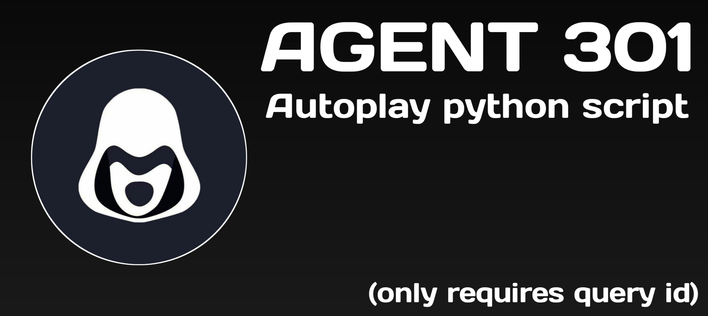

# Agent 301 - Auto Claim Bot

[Register here](https://t.me/Agent301Bot/app?startapp=onetime5760224255)

<div align="center">
  
</div>

## 🌟 Features

| Feature            | Status | Description                 |
| ------------------ | ------ | --------------------------- |
| Auto Do Task       | On/Off | Complete tasks              |
| Auto Do Wheel Task | On/Off | Do task to get wheel ticket |
| Auto Spin Wheel    | On/Off | Spin wheel to get reward    |

## Installation
1. Make sure you have installed python and git.
   
   python
   ```
   pkg install python
   ```

   git
   ```
   pkg install git
   ```

2. Clone this repository
   ```shell
   git clone https://github.com/zyz-airdrops/agent301-claimer.git
   ```

3. goto agent301-claimer directory
   ```
   cd agent301-claimer
   ```

4. install the require library
   ```
   python -m pip install -r requirements.txt
   ```

5. Edit `data.txt`, input you data token in `data.txt`, tutorial on [How to Get Data](https://youtu.be/z_ghRgIcGxI). One line for one data account, if you want add you second account add in new line!

You can edit the data.txt with `nano` / `vim` / `Visual Studio Code` 

6. execute the main program 
   ```
   python bot.py
   ```


## 🚀 Run File

| Run with Proxy                   | Run without Proxy   |
| -------------------------------- | ------------------- |
| `python bot-proxy.py` | `python bot.py` |

## ⚠️ Note

- Get auth data (`query_id=... /user=...`) in the `Application` tab in DevTools.
- Auto features: Change `false` to `true` in the `config.json` file.
- Supported commands: `/run_bot` `/query_id` `/proxy` `/proxy_web` (Join group to use these commands).
